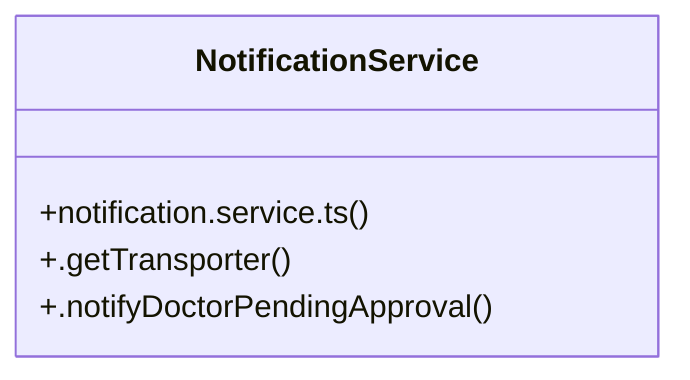

# Community 14

> 4 nodes · cohesion 0.67

## Key Concepts

- [NotificationService](file:///C:/Users/rlira/Desktop/Rorro/Programacion/medgram/apps/api/src/notifications/notification.service.ts#L5) (3 connections)
- [.notifyDoctorPendingApproval()](file:///C:/Users/rlira/Desktop/Rorro/Programacion/medgram/apps/api/src/notifications/notification.service.ts#L31) (3 connections)
- [.getTransporter()](file:///C:/Users/rlira/Desktop/Rorro/Programacion/medgram/apps/api/src/notifications/notification.service.ts#L10) (2 connections)
- [notification.service.ts](file:///C:/Users/rlira/Desktop/Rorro/Programacion/medgram/apps/api/src/notifications/notification.service.ts#L1) (1 connections)

## Class Diagram

## Relationships

- No strong cross-community connections detected

## Source Files

- [C:\Users\rlira\Desktop\Rorro\Programacion\medgram\apps\api\src\notifications\notification.service.ts](file:///C:/Users/rlira/Desktop/Rorro/Programacion/medgram/apps/api/src/notifications/notification.service.ts)

## Audit Trail

- EXTRACTED: 8 (89%)
- INFERRED: 1 (11%)
- AMBIGUOUS: 0 (0%)

---

*Part of the graphify knowledge wiki. See [[index]] to navigate.*