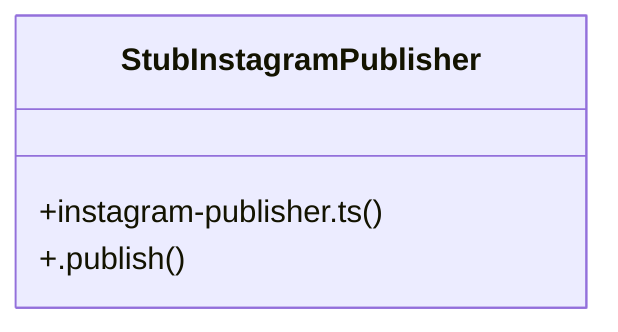

# Community 16

> 4 nodes · cohesion 0.50

## Key Concepts

- [instagram-publisher.ts](file:///C:/Users/rlira/Desktop/Rorro/Programacion/medgram/apps/api/src/publishing/instagram-publisher.ts#L1) (2 connections)
- [StubInstagramPublisher](file:///C:/Users/rlira/Desktop/Rorro/Programacion/medgram/apps/api/src/publishing/instagram-publisher.ts#L42) (2 connections)
- [.publish()](file:///C:/Users/rlira/Desktop/Rorro/Programacion/medgram/apps/api/src/publishing/instagram-publisher.ts#L45) (2 connections)
- [INSTAGRAM_PUBLISHER](file:///C:/Users/rlira/Desktop/Rorro/Programacion/medgram/apps/api/src/publishing/instagram-publisher.ts#L3) (1 connections)

## Class Diagram

## Relationships

- No strong cross-community connections detected

## Source Files

- [C:\Users\rlira\Desktop\Rorro\Programacion\medgram\apps\api\src\publishing\instagram-publisher.ts](file:///C:/Users/rlira/Desktop/Rorro/Programacion/medgram/apps/api/src/publishing/instagram-publisher.ts)

## Audit Trail

- EXTRACTED: 6 (86%)
- INFERRED: 1 (14%)
- AMBIGUOUS: 0 (0%)

---

*Part of the graphify knowledge wiki. See [[index]] to navigate.*