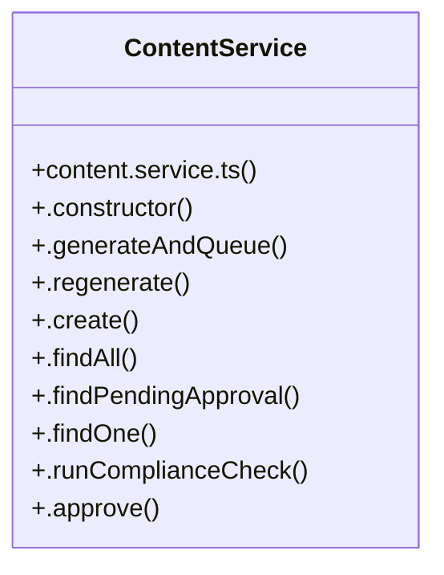

# Community 2

> 22 nodes · cohesion 0.19

## Key Concepts

- [ContentService](file:///C:/Users/rlira/Desktop/Rorro/Programacion/medgram/apps/api/src/content/content.service.ts#L19) (18 connections)
- [.findOne()](file:///C:/Users/rlira/Desktop/Rorro/Programacion/medgram/apps/api/src/content/content.service.ts#L136) (12 connections)
- [.create()](file:///C:/Users/rlira/Desktop/Rorro/Programacion/medgram/apps/api/src/content/content.service.ts#L103) (8 connections)
- [.runComplianceCheck()](file:///C:/Users/rlira/Desktop/Rorro/Programacion/medgram/apps/api/src/content/content.service.ts#L153) (8 connections)
- [.generateAndQueue()](file:///C:/Users/rlira/Desktop/Rorro/Programacion/medgram/apps/api/src/content/content.service.ts#L32) (6 connections)
- [.regenerate()](file:///C:/Users/rlira/Desktop/Rorro/Programacion/medgram/apps/api/src/content/content.service.ts#L62) (5 connections)
- [.requirePending()](file:///C:/Users/rlira/Desktop/Rorro/Programacion/medgram/apps/api/src/content/content.service.ts#L326) (5 connections)
- [.process()](file:///C:/Users/rlira/Desktop/Rorro/Programacion/medgram/apps/api/src/publishing/publish.worker.ts#L34) (5 connections)
- [.approve()](file:///C:/Users/rlira/Desktop/Rorro/Programacion/medgram/apps/api/src/content/content.service.ts#L205) (4 connections)
- [.markPublishFailed()](file:///C:/Users/rlira/Desktop/Rorro/Programacion/medgram/apps/api/src/content/content.service.ts#L287) (4 connections)
- [.reject()](file:///C:/Users/rlira/Desktop/Rorro/Programacion/medgram/apps/api/src/content/content.service.ts#L218) (4 connections)
- [.requestChanges()](file:///C:/Users/rlira/Desktop/Rorro/Programacion/medgram/apps/api/src/content/content.service.ts#L229) (4 connections)
- [.requireDoctor()](file:///C:/Users/rlira/Desktop/Rorro/Programacion/medgram/apps/api/src/content/content.service.ts#L336) (4 connections)
- [.markPublished()](file:///C:/Users/rlira/Desktop/Rorro/Programacion/medgram/apps/api/src/content/content.service.ts#L265) (3 connections)
- [.markScheduled()](file:///C:/Users/rlira/Desktop/Rorro/Programacion/medgram/apps/api/src/content/content.service.ts#L243) (3 connections)
- [content.service.ts](file:///C:/Users/rlira/Desktop/Rorro/Programacion/medgram/apps/api/src/content/content.service.ts#L1) (2 connections)
- [.logTransition()](file:///C:/Users/rlira/Desktop/Rorro/Programacion/medgram/apps/api/src/content/content.service.ts#L301) (2 connections)
- [bootstrap()](file:///C:/Users/rlira/Desktop/Rorro/Programacion/medgram/apps/api/src/main.ts#L6) (2 connections)
- [main.ts](file:///C:/Users/rlira/Desktop/Rorro/Programacion/medgram/apps/api/src/main.ts#L1) (1 connections)
- [.constructor()](file:///C:/Users/rlira/Desktop/Rorro/Programacion/medgram/apps/api/src/content/content.service.ts#L22) (1 connections)
- [.findAll()](file:///C:/Users/rlira/Desktop/Rorro/Programacion/medgram/apps/api/src/content/content.service.ts#L121) (1 connections)
- [RECHECKABLE_STATUSES](file:///C:/Users/rlira/Desktop/Rorro/Programacion/medgram/apps/api/src/content/content.service.ts#L16) (1 connections)

## Class Diagram

## Relationships

- No strong cross-community connections detected

## Source Files

- [C:\Users\rlira\Desktop\Rorro\Programacion\medgram\apps\api\src\content\content.service.ts](file:///C:/Users/rlira/Desktop/Rorro/Programacion/medgram/apps/api/src/content/content.service.ts)
- [C:\Users\rlira\Desktop\Rorro\Programacion\medgram\apps\api\src\main.ts](file:///C:/Users/rlira/Desktop/Rorro/Programacion/medgram/apps/api/src/main.ts)
- [C:\Users\rlira\Desktop\Rorro\Programacion\medgram\apps\api\src\publishing\publish.worker.ts](file:///C:/Users/rlira/Desktop/Rorro/Programacion/medgram/apps/api/src/publishing/publish.worker.ts)

## Audit Trail

- EXTRACTED: 84 (82%)
- INFERRED: 19 (18%)
- AMBIGUOUS: 0 (0%)

---

*Part of the graphify knowledge wiki. See [[index]] to navigate.*