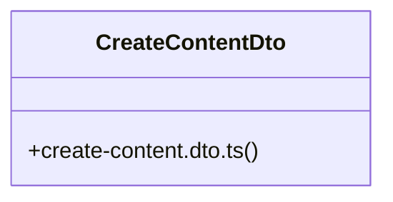

# Community 25

> 2 nodes · cohesion 1.00

## Key Concepts

- [create-content.dto.ts](file:///C:/Users/rlira/Desktop/Rorro/Programacion/medgram/apps/api/src/content/dto/create-content.dto.ts#L1) (1 connections)
- [CreateContentDto](file:///C:/Users/rlira/Desktop/Rorro/Programacion/medgram/apps/api/src/content/dto/create-content.dto.ts#L4) (1 connections)

## Class Diagram

## Relationships

- No strong cross-community connections detected

## Source Files

- [C:\Users\rlira\Desktop\Rorro\Programacion\medgram\apps\api\src\content\dto\create-content.dto.ts](file:///C:/Users/rlira/Desktop/Rorro/Programacion/medgram/apps/api/src/content/dto/create-content.dto.ts)

## Audit Trail

- EXTRACTED: 2 (100%)
- INFERRED: 0 (0%)
- AMBIGUOUS: 0 (0%)

---

*Part of the graphify knowledge wiki. See [[index]] to navigate.*