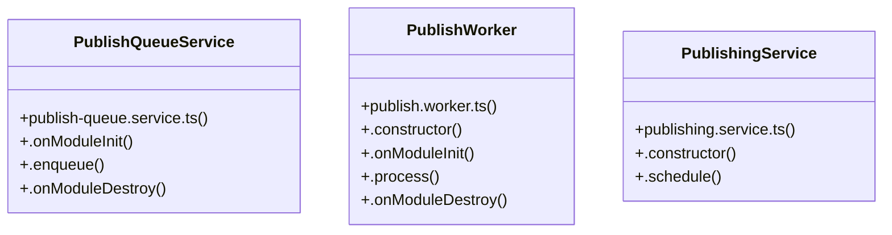

# Community 5

> 16 nodes · cohesion 0.13

## Key Concepts

- [PublishWorker](file:///C:/Users/rlira/Desktop/Rorro/Programacion/medgram/apps/api/src/publishing/publish.worker.ts#L12) (5 connections)
- [PublishQueueService](file:///C:/Users/rlira/Desktop/Rorro/Programacion/medgram/apps/api/src/publishing/publish-queue.service.ts#L19) (4 connections)
- [publish-queue.service.ts](file:///C:/Users/rlira/Desktop/Rorro/Programacion/medgram/apps/api/src/publishing/publish-queue.service.ts#L1) (3 connections)
- [redisConnection()](file:///C:/Users/rlira/Desktop/Rorro/Programacion/medgram/apps/api/src/publishing/publish-queue.service.ts#L11) (3 connections)
- [PublishingService](file:///C:/Users/rlira/Desktop/Rorro/Programacion/medgram/apps/api/src/publishing/publishing.service.ts#L6) (3 connections)
- [.schedule()](file:///C:/Users/rlira/Desktop/Rorro/Programacion/medgram/apps/api/src/publishing/publishing.service.ts#L16) (3 connections)
- [.enqueue()](file:///C:/Users/rlira/Desktop/Rorro/Programacion/medgram/apps/api/src/publishing/publish-queue.service.ts#L30) (2 connections)
- [.onModuleInit()](file:///C:/Users/rlira/Desktop/Rorro/Programacion/medgram/apps/api/src/publishing/publish-queue.service.ts#L24) (2 connections)
- [.onModuleInit()](file:///C:/Users/rlira/Desktop/Rorro/Programacion/medgram/apps/api/src/publishing/publish.worker.ts#L22) (2 connections)
- [publish.worker.ts](file:///C:/Users/rlira/Desktop/Rorro/Programacion/medgram/apps/api/src/publishing/publish.worker.ts#L1) (1 connections)
- [publishing.service.ts](file:///C:/Users/rlira/Desktop/Rorro/Programacion/medgram/apps/api/src/publishing/publishing.service.ts#L1) (1 connections)
- [PUBLISH_QUEUE](file:///C:/Users/rlira/Desktop/Rorro/Programacion/medgram/apps/api/src/publishing/publish-queue.service.ts#L5) (1 connections)
- [.onModuleDestroy()](file:///C:/Users/rlira/Desktop/Rorro/Programacion/medgram/apps/api/src/publishing/publish-queue.service.ts#L46) (1 connections)
- [.constructor()](file:///C:/Users/rlira/Desktop/Rorro/Programacion/medgram/apps/api/src/publishing/publish.worker.ts#L17) (1 connections)
- [.onModuleDestroy()](file:///C:/Users/rlira/Desktop/Rorro/Programacion/medgram/apps/api/src/publishing/publish.worker.ts#L55) (1 connections)
- [.constructor()](file:///C:/Users/rlira/Desktop/Rorro/Programacion/medgram/apps/api/src/publishing/publishing.service.ts#L7) (1 connections)

## Class Diagram

## Relationships

- No strong cross-community connections detected

## Source Files

- [C:\Users\rlira\Desktop\Rorro\Programacion\medgram\apps\api\src\publishing\publish-queue.service.ts](file:///C:/Users/rlira/Desktop/Rorro/Programacion/medgram/apps/api/src/publishing/publish-queue.service.ts)
- [C:\Users\rlira\Desktop\Rorro\Programacion\medgram\apps\api\src\publishing\publish.worker.ts](file:///C:/Users/rlira/Desktop/Rorro/Programacion/medgram/apps/api/src/publishing/publish.worker.ts)
- [C:\Users\rlira\Desktop\Rorro\Programacion\medgram\apps\api\src\publishing\publishing.service.ts](file:///C:/Users/rlira/Desktop/Rorro/Programacion/medgram/apps/api/src/publishing/publishing.service.ts)

## Audit Trail

- EXTRACTED: 29 (85%)
- INFERRED: 5 (15%)
- AMBIGUOUS: 0 (0%)

---

*Part of the graphify knowledge wiki. See [[index]] to navigate.*