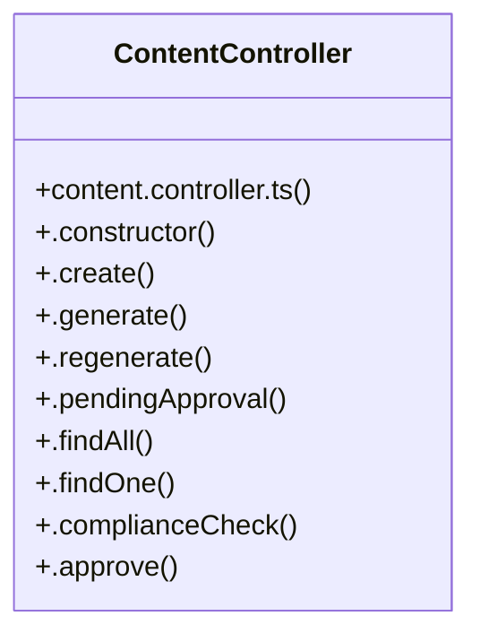

# Community 6

> 15 nodes · cohesion 0.13

## Key Concepts

- [ContentController](file:///C:/Users/rlira/Desktop/Rorro/Programacion/medgram/apps/api/src/content/content.controller.ts#L24) (12 connections)
- [content.controller.ts](file:///C:/Users/rlira/Desktop/Rorro/Programacion/medgram/apps/api/src/content/content.controller.ts#L1) (2 connections)
- [.complianceCheck()](file:///C:/Users/rlira/Desktop/Rorro/Programacion/medgram/apps/api/src/content/content.controller.ts#L61) (2 connections)
- [.generate()](file:///C:/Users/rlira/Desktop/Rorro/Programacion/medgram/apps/api/src/content/content.controller.ts#L33) (2 connections)
- [.pendingApproval()](file:///C:/Users/rlira/Desktop/Rorro/Programacion/medgram/apps/api/src/content/content.controller.ts#L43) (2 connections)
- [.findPendingApproval()](file:///C:/Users/rlira/Desktop/Rorro/Programacion/medgram/apps/api/src/content/content.service.ts#L128) (2 connections)
- [.approve()](file:///C:/Users/rlira/Desktop/Rorro/Programacion/medgram/apps/api/src/content/content.controller.ts#L66) (1 connections)
- [.constructor()](file:///C:/Users/rlira/Desktop/Rorro/Programacion/medgram/apps/api/src/content/content.controller.ts#L25) (1 connections)
- [.create()](file:///C:/Users/rlira/Desktop/Rorro/Programacion/medgram/apps/api/src/content/content.controller.ts#L28) (1 connections)
- [.findAll()](file:///C:/Users/rlira/Desktop/Rorro/Programacion/medgram/apps/api/src/content/content.controller.ts#L48) (1 connections)
- [.findOne()](file:///C:/Users/rlira/Desktop/Rorro/Programacion/medgram/apps/api/src/content/content.controller.ts#L56) (1 connections)
- [.regenerate()](file:///C:/Users/rlira/Desktop/Rorro/Programacion/medgram/apps/api/src/content/content.controller.ts#L38) (1 connections)
- [.reject()](file:///C:/Users/rlira/Desktop/Rorro/Programacion/medgram/apps/api/src/content/content.controller.ts#L75) (1 connections)
- [.requestChanges()](file:///C:/Users/rlira/Desktop/Rorro/Programacion/medgram/apps/api/src/content/content.controller.ts#L84) (1 connections)
- [DEFAULT_REVIEWER](file:///C:/Users/rlira/Desktop/Rorro/Programacion/medgram/apps/api/src/content/content.controller.ts#L21) (1 connections)

## Class Diagram

## Relationships

- No strong cross-community connections detected

## Source Files

- [C:\Users\rlira\Desktop\Rorro\Programacion\medgram\apps\api\src\content\content.controller.ts](file:///C:/Users/rlira/Desktop/Rorro/Programacion/medgram/apps/api/src/content/content.controller.ts)
- [C:\Users\rlira\Desktop\Rorro\Programacion\medgram\apps\api\src\content\content.service.ts](file:///C:/Users/rlira/Desktop/Rorro/Programacion/medgram/apps/api/src/content/content.service.ts)

## Audit Trail

- EXTRACTED: 27 (87%)
- INFERRED: 4 (13%)
- AMBIGUOUS: 0 (0%)

---

*Part of the graphify knowledge wiki. See [[index]] to navigate.*