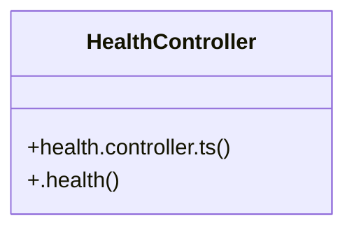

# Health Monitoring

> 3 nodes · cohesion 0.67

## Key Concepts

- [HealthController](file:///C:/Users/rlira/Desktop/Rorro/Programacion/medgram/apps/api/src/health.controller.ts#L4) (2 connections)
- [health.controller.ts](file:///C:/Users/rlira/Desktop/Rorro/Programacion/medgram/apps/api/src/health.controller.ts#L1) (1 connections)
- [.health()](file:///C:/Users/rlira/Desktop/Rorro/Programacion/medgram/apps/api/src/health.controller.ts#L6) (1 connections)

## Class Diagram

## Relationships

- No strong cross-community connections detected

## Source Files

- [C:\Users\rlira\Desktop\Rorro\Programacion\medgram\apps\api\src\health.controller.ts](file:///C:/Users/rlira/Desktop/Rorro/Programacion/medgram/apps/api/src/health.controller.ts)

## Audit Trail

- EXTRACTED: 4 (100%)
- INFERRED: 0 (0%)
- AMBIGUOUS: 0 (0%)

---

*Part of the graphify knowledge wiki. See [[index]] to navigate.*