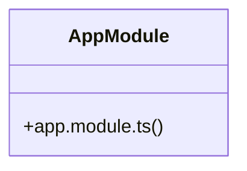

# Root Module

> 2 nodes · cohesion 1.00

## Key Concepts

- [AppModule](file:///C:/Users/rlira/Desktop/Rorro/Programacion/medgram/apps/api/src/app.module.ts#L17) (1 connections)
- [app.module.ts](file:///C:/Users/rlira/Desktop/Rorro/Programacion/medgram/apps/api/src/app.module.ts#L1) (1 connections)

## Class Diagram

## Relationships

- No strong cross-community connections detected

## Source Files

- [C:\Users\rlira\Desktop\Rorro\Programacion\medgram\apps\api\src\app.module.ts](file:///C:/Users/rlira/Desktop/Rorro/Programacion/medgram/apps/api/src/app.module.ts)

## Audit Trail

- EXTRACTED: 2 (100%)
- INFERRED: 0 (0%)
- AMBIGUOUS: 0 (0%)

---

*Part of the graphify knowledge wiki. See [[index]] to navigate.*