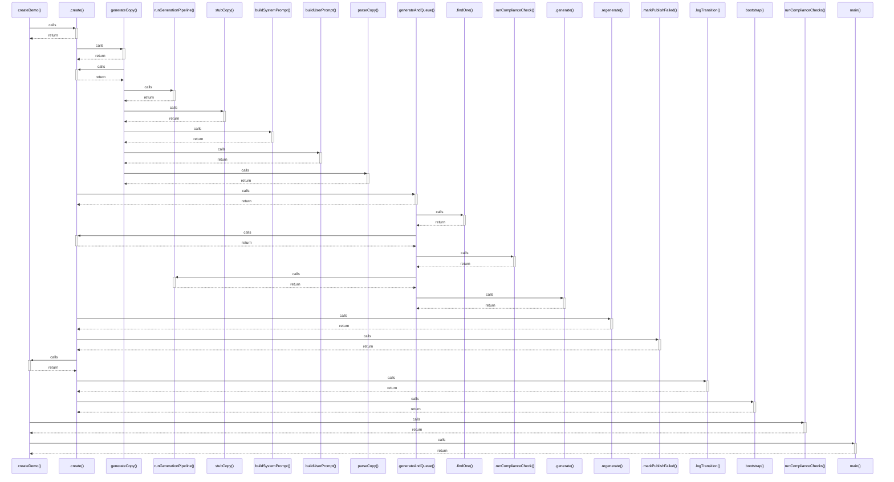

# createDemo()

> God node · 4 connections · [C:\Users\rlira\Desktop\Rorro\Programacion\medgram\apps\api\prisma\seed-demo.ts](file:///C:/Users/rlira/Desktop/Rorro/Programacion/medgram/apps/api/prisma/seed-demo.ts#L158)

## Call Trace Diagram

## Connections by Relation

### calls
- [[.create()]] `INFERRED`
- [[runComplianceChecks()]] `INFERRED`
- [[main()]] `EXTRACTED`

### contains
- [[seed-demo.ts]] `EXTRACTED`

---

*Part of the graphify knowledge wiki. See [[index]] to navigate.*