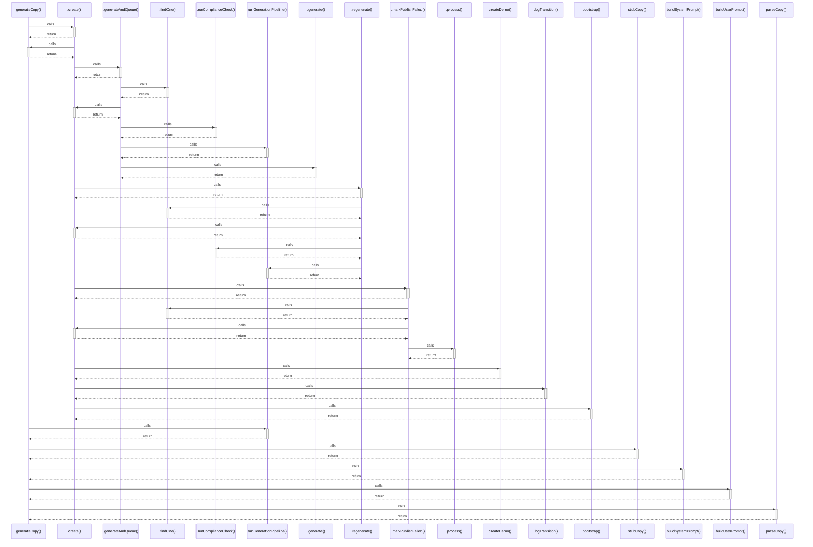

# generateCopy()

> God node · 7 connections · [C:\Users\rlira\Desktop\Rorro\Programacion\medgram\packages\content-pipeline\src\generator.ts](file:///C:/Users/rlira/Desktop/Rorro/Programacion/medgram/packages/content-pipeline/src/generator.ts#L114)

## Call Trace Diagram

## Connections by Relation

### calls
- [[.create()]] `INFERRED`
- [[runGenerationPipeline()]] `INFERRED`
- [[stubCopy()]] `EXTRACTED`
- [[buildSystemPrompt()]] `EXTRACTED`
- [[buildUserPrompt()]] `EXTRACTED`
- [[parseCopy()]] `EXTRACTED`

### contains
- [[generator.ts]] `EXTRACTED`

---

*Part of the graphify knowledge wiki. See [[index]] to navigate.*