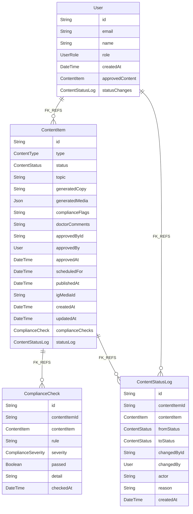

# Knowledge Graph Index

> Auto-generated by graphify. Start here — read community articles for context, then drill into god nodes for detail.

**295 nodes · 315 edges · 45 communities**

---

## System Architecture Flowchart

```mermaid
flowchart TD
    C0["Content Workflow (37 nodes)"]
    C1["Community 1 (27 nodes)"]
    C2["Community 2 (22 nodes)"]
    C3["Community 3 (19 nodes)"]
    C4["Compliance Pipeline (18 nodes)"]
    C5["Community 5 (16 nodes)"]
    C6["Community 6 (15 nodes)"]
    C7["Community 7 (15 nodes)"]
    C8["Community 8 (13 nodes)"]
    C9["Community 9 (12 nodes)"]
    C10["Community 10 (11 nodes)"]
    C11["Data Loader UI (10 nodes)"]
    C12["Community 12 (8 nodes)"]
    C13["Community 13 (4 nodes)"]
    C14["Community 14 (4 nodes)"]
    C15["Community 15 (4 nodes)"]
    C16["Community 16 (4 nodes)"]
    C17["Community 17 (4 nodes)"]
    C18["Link Routing (4 nodes)"]
    C19["Community 19 (4 nodes)"]
    C20["Database Access (3 nodes)"]
    C21["Health Monitoring (3 nodes)"]
    C22["Metadata Service (3 nodes)"]
    C23["Root Module (2 nodes)"]
    C24["Community 24 (2 nodes)"]
    C25["Community 25 (2 nodes)"]
    C26["Content Generation (2 nodes)"]
    C27["Data Access Layer (2 nodes)"]
    C28["Content Publishing (2 nodes)"]
    C29["Community 29 (2 nodes)"]
    C30["Next.js config (2 nodes)"]
    C31["API & Jobs (2 nodes)"]
    C32["unknown (1 nodes)"]
    C33["unknown (1 nodes)"]
    C34["unknown (1 nodes)"]
    C35["Database ORM (1 nodes)"]
    C36["Database Access (1 nodes)"]
    C37["React UI (1 nodes)"]
    C38["TypeScript Compiler (1 nodes)"]
    C39["Node Runtime (1 nodes)"]
    C40["App Layer (1 nodes)"]
    C41["Community 41 (1 nodes)"]
    C42["Concurrency Control (1 nodes)"]
    C43["TypeScript Compiler (1 nodes)"]
    C44["Source Code (1 nodes)"]
    C2 -->|4 edges| C4
    C7 -->|3 edges| C3
    C6 -->|2 edges| C2
    C4 -->|1 edges| C2
    C2 -->|1 edges| C6
    C2 -->|1 edges| C12
    C2 -->|1 edges| C14
    C2 -->|1 edges| C5
    C16 -->|1 edges| C2
    C5 -->|1 edges| C2
    C11 -->|1 edges| C0
    C12 -->|1 edges| C4
```

## Database Schema (ERD)

## Communities
(sorted by size, largest first)

- [[Content Workflow]] — 37 nodes
- [[Community 1]] — 27 nodes
- [[Community 2]] — 22 nodes
- [[Community 3]] — 19 nodes
- [[Compliance Pipeline]] — 18 nodes
- [[Community 5]] — 16 nodes
- [[Community 6]] — 15 nodes
- [[Community 7]] — 15 nodes
- [[Community 8]] — 13 nodes
- [[Community 9]] — 12 nodes
- [[Community 10]] — 11 nodes
- [[Data Loader UI]] — 10 nodes
- [[Community 12]] — 8 nodes
- [[Community 13]] — 4 nodes
- [[Community 14]] — 4 nodes
- [[Community 15]] — 4 nodes
- [[Community 16]] — 4 nodes
- [[Community 17]] — 4 nodes
- [[Link Routing]] — 4 nodes
- [[Community 19]] — 4 nodes
- [[Database Access]] — 3 nodes
- [[Health Monitoring]] — 3 nodes
- [[Metadata Service]] — 3 nodes
- [[Root Module]] — 2 nodes
- [[Community 24]] — 2 nodes
- [[Community 25]] — 2 nodes
- [[Content Generation]] — 2 nodes
- [[Data Access Layer]] — 2 nodes
- [[Content Publishing]] — 2 nodes
- [[Community 29]] — 2 nodes
- [[Next.js config]] — 2 nodes
- [[API & Jobs]] — 2 nodes
- [[unknown]] — 1 nodes
- [[unknown]] — 1 nodes
- [[unknown]] — 1 nodes
- [[Database ORM]] — 1 nodes
- [[Database Access]] — 1 nodes
- [[React UI]] — 1 nodes
- [[TypeScript Compiler]] — 1 nodes
- [[Node Runtime]] — 1 nodes
- [[App Layer]] — 1 nodes
- [[Community 41]] — 1 nodes
- [[Concurrency Control]] — 1 nodes
- [[TypeScript Compiler]] — 1 nodes
- [[Source Code]] — 1 nodes

## God Nodes
(most connected concepts — the load-bearing abstractions)

- [[ContentService]] — 18 connections
- [[ContentController]] — 12 connections
- [[Gate de Aprobación Obligatorio del Doctor]] — 9 connections
- [[runGenerationPipeline()]] — 8 connections
- [[generateCopy()]] — 7 connections
- [[PublishWorker]] — 5 connections
- [[Colegio Médico de Chile — Código de Ética]] — 5 connections
- [[Dashboard de Aprobación del Doctor]] — 5 connections
- [[ContentItem (modelo de datos)]] — 5 connections
- [[createDemo()]] — 4 connections

---

*Generated by [graphify](https://github.com/safishamsi/graphify)*