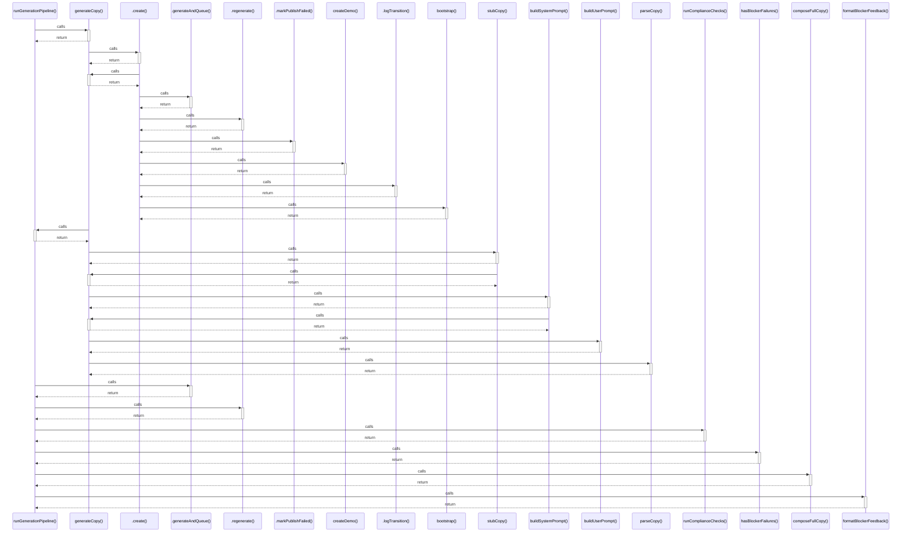

# runGenerationPipeline()

> God node · 8 connections · [C:\Users\rlira\Desktop\Rorro\Programacion\medgram\packages\content-pipeline\src\pipeline.ts](file:///C:/Users/rlira/Desktop/Rorro/Programacion/medgram/packages/content-pipeline/src/pipeline.ts#L51)

## Call Trace Diagram

## Connections by Relation

### calls
- [[generateCopy()]] `INFERRED`
- [[.generateAndQueue()]] `INFERRED`
- [[.regenerate()]] `INFERRED`
- [[runComplianceChecks()]] `INFERRED`
- [[hasBlockerFailures()]] `INFERRED`
- [[composeFullCopy()]] `EXTRACTED`
- [[formatBlockerFeedback()]] `EXTRACTED`

### contains
- [[pipeline.ts]] `EXTRACTED`

---

*Part of the graphify knowledge wiki. See [[index]] to navigate.*